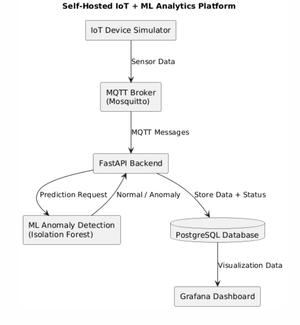
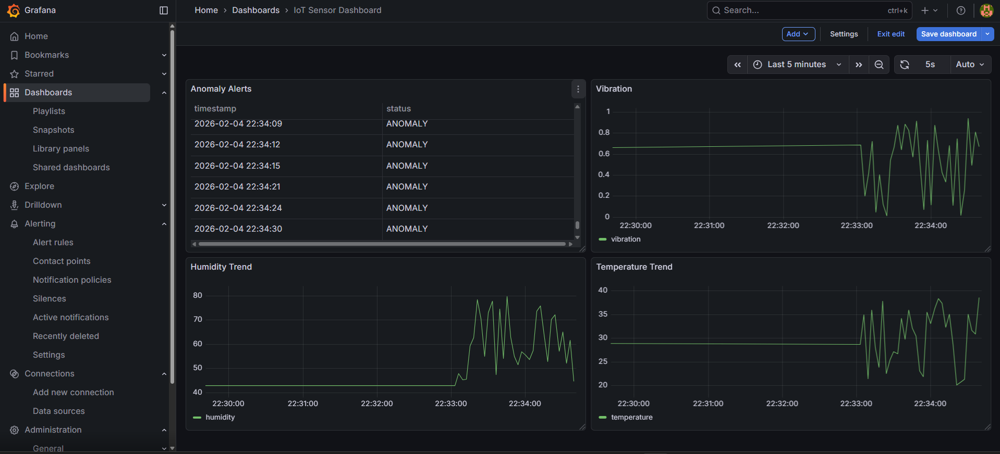

# 🚀 Self-Hosted IoT + ML Analytics Platform

A production-style IoT analytics system built locally using Docker, Machine Learning, and real-time monitoring tools.

This project simulates how modern cloud IoT systems collect device data, process it, run ML models, store results, and visualize insights.

---

## 📌 Project Overview

This system simulates an IoT sensor device that continuously sends environmental data such as temperature, humidity, and vibration.

The data pipeline:

- Sensor data is generated by a virtual IoT device  
- Transmitted via MQTT protocol  
- Processed by a FastAPI backend  
- Analyzed using a Machine Learning model for anomaly detection  
- Stored in PostgreSQL database  
- Visualized in Grafana dashboards  

The entire system runs locally but follows real-world cloud architecture principles.

---

## 🏗 System Architecture



---

## ⚙️ Tech Stack

| Layer | Technology |
|------|------------|
| IoT Simulation | Python |
| Communication | MQTT (Eclipse Mosquitto) |
| Backend | FastAPI |
| Machine Learning | Scikit-learn (Isolation Forest) |
| Database | PostgreSQL |
| Visualization | Grafana |
| DevOps | Docker & Docker Compose |

---

## 🧠 Key Features

✔ Real-time IoT device simulation  
✔ MQTT-based communication system  
✔ Backend data ingestion with FastAPI  
✔ Machine Learning anomaly detection  
✔ Storage of sensor data + prediction results  
✔ REST API endpoint for alerts  
✔ Real-time monitoring dashboards  
✔ Fully containerized architecture  

---

## 📊 Machine Learning Functionality

The ML model detects abnormal sensor behavior such as:

- Unusual vibration spikes  
- Sudden temperature rise  
- Values outside normal operating range  

This simulates **predictive maintenance** used in smart factories and industrial IoT monitoring systems.

---

## 🌐 API Endpoint

### Get Latest Anomaly Alerts
Returns recent sensor readings classified as **ANOMALY** by the ML model.

---

## 📈 Dashboard Preview

### Full System Monitoring


### Anomaly Detection View


---

## ▶️ How to Run the Project

### 🔧 Prerequisites

Make sure you have installed:

- Python 3.10+
- Docker Desktop
- Git

---

### 1️⃣ Clone the Repository

```bash
git clone <your-repository-url>
cd iot-ml-analytics-platform
2️⃣ Start Infrastructure Services
This starts:

PostgreSQL database

MQTT broker (Mosquitto)

Grafana dashboard

docker-compose up -d
Wait ~10 seconds, then verify:

docker ps
3️⃣ Start the Backend Server
cd backend
python -m venv venv
venv\Scripts\activate
pip install -r requirements.txt
uvicorn app.main:app --reload
You should see:

Backend connected to MQTT Broker!
4️⃣ Start IoT Device Simulator
Open a new terminal window:

cd device_simulator
python -m venv venv
venv\Scripts\activate
pip install -r requirements.txt
python simulator.py
Sensor data will start streaming to the backend.

5️⃣ View the Dashboard
Open your browser:

http://localhost:3000
Login:

Username: admin
Password: admin
You will see live sensor graphs and anomaly monitoring.

6️⃣ View Alerts API
Open in browser:

http://127.0.0.1:8000/alerts
Returns latest ML-detected anomalies in JSON format.


---

This is now **step-by-step reproducible** — exactly what recruiters look for when they test a project.


🗂 Project Structure
iot-ml-analytics-platform/
│
├── device_simulator/   
├── backend/            
├── dashboard/ 
├── database/ 
├── ml_model/           
├── mqtt/               
├── docker-compose.yml  
├── architecture.png    
├── dashboard1.png      
├── dashboard2.png      
└── README.md

🔮 Future Improvements

Cloud deployment (AWS/GCP)
Alert notifications (email/telegram)
User authentication
Advanced ML models

👩‍💻 Author
Mariam Jojo

Engineering student passionate about building real-world software systems that combine IoT, AI, cloud, and data.
This project was built as a hands-on journey to understand how intelligent systems work end-to-end — from sensor data to machine learning to live dashboards.
